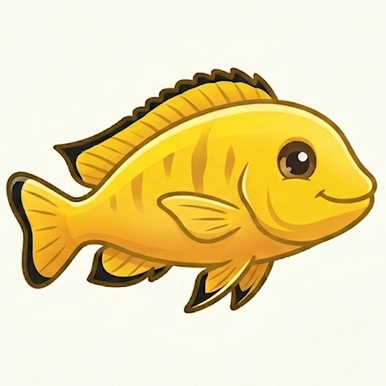

<div align="center">



# LemonFish

**Codename LemonFish** | A hardened fork of [MiroFish](https://github.com/666ghj/MiroFish)

*Multi-agent prediction engine with resilience, internationalisation, and slim deployment*

[](https://github.com/Lvigentini/MiroFish/stargazers)
[](https://github.com/Lvigentini/MiroFish/network)
[](LICENSE)

[English](./README.md) | [Architecture Docs](./docs/ARCHITECTURE.md) | [Feature Roadmap](./docs/new_features_planning.md)

</div>

---

## What's different from MiroFish?

LemonFish takes the MiroFish multi-agent simulation engine and makes it **production-ready, resilient, and accessible**:

| Feature | MiroFish | LemonFish |
|---------|----------|-----------|
| LLM failure handling | None (single call, hard crash) | Exponential backoff + fallback model chain |
| Free-tier support | Requires paid API (DashScope) | OpenRouter free models with 4-model fallback |
| Language support | Chinese UI + hardcoded backend strings | Full i18n (Chinese, English, Spanish) |
| Docker image | 14GB (full Debian + CUDA torch) | ~2-3GB slim (CPU-only torch, multi-stage build) |
| Setup experience | Manual .env editing | Interactive setup wizard (`./setup.sh`) |
| Network access | localhost only | Remote-accessible out of the box |
| Documentation | Chinese README | Full architecture deep-dive + feature planning |
| Multi-model agents | Single LLM for all agents | Planned: randomised model assignment per persona |

---

## Quick Start

```bash
git clone https://github.com/Lvigentini/MiroFish.git lemonfish
cd lemonfish
./setup.sh
```

The setup wizard will:
1. Ask you to pick an LLM provider (OpenRouter free, OpenAI, Gemini, DeepSeek, Claude, Grok, Qwen, Kimi)
2. Ask for your API key
3. Ask for a Zep Cloud key (free tier: [app.getzep.com](https://app.getzep.com/))
4. Build an optimised Docker image and launch

Open **http://localhost:3000** when done.

### Supported LLM Providers

Any OpenAI SDK-compatible API works. Tested with:

| Provider | Free tier? | Notes |
|----------|-----------|-------|
| **OpenRouter** | Yes (multiple free models) | Recommended for getting started |
| **Google Gemini** | Yes (generous) | Via AI Studio |
| **OpenAI** | No | gpt-4o-mini recommended |
| **DeepSeek** | No | Cheapest paid option |
| **Anthropic Claude** | No | May not support JSON mode |
| **Grok (xAI)** | No | May not support JSON mode |
| **Alibaba Qwen** | Limited | Original MiroFish default |
| **Kimi / Moonshot** | Limited | May not support all features |

---

## How It Works

LemonFish predicts outcomes by simulating social dynamics. Upload documents about a topic, describe what you want to predict, and the engine builds a parallel digital world populated with AI agents who discuss, argue, and react — then produces a prediction report.

### The 5-Step Pipeline

```
  Documents          Knowledge          Agent               Social Media        Prediction
  (PDF/MD/TXT)  -->  Graph         -->  Personas       -->  Simulation     -->  Report
                     (Zep Cloud)        (LLM-generated)     (Twitter+Reddit)    (ReportAgent)
```

**Step 1 - Graph Building**: Your documents are chunked and ingested into a Zep Cloud knowledge graph. An LLM designs an ontology (entity types, relationships) specific to your topic. Zep extracts entities and builds the graph.

**Step 2 - Environment Setup**: Each entity from the graph becomes an AI agent with a rich persona — biography, personality (MBTI), profession, interests, demographics. All generated by LLM and grounded in the source material.

**Step 3 - Simulation**: Agents are placed on simulated Twitter and Reddit. They post, comment, like, follow, and argue — driven by their personas and the LLM. Each round advances simulated time. Dynamic memory updates as agents form opinions and react to each other.

**Step 4 - Report Generation**: A ReportAgent with tool access (graph search, agent interviews, simulation data analysis) produces a structured prediction report with confidence scores.

**Step 5 - Deep Interaction**: Chat with any agent in the simulated world. Ask the ReportAgent follow-up questions. Run additional interviews.

For a full technical walkthrough, see [docs/ARCHITECTURE.md](./docs/ARCHITECTURE.md).

---

## Resilience Features

LemonFish is designed to survive the realities of free-tier LLM APIs:

**LLM Retry with Backoff**: Every LLM call retries up to 3 times with exponential backoff (2s, 4s, 8s). Catches 429, 500-504, timeouts, and connection errors.

**Fallback Model Chain**: When the primary model is exhausted, automatically cycles through fallback models. Default chain for OpenRouter:
```
gemma-4-31b → llama-3.3-70b → hermes-3-405b → nemotron-120b → openrouter/free
```

**Per-Batch Graph Building**: If batch 47 of 100 fails during graph construction, batches 1-46 are preserved. Each batch retries independently.

**Configurable via .env**:
```env
LLM_FALLBACK_MODELS=model1:free,model2:free,model3:free
LLM_MAX_RETRIES=3
LLM_RETRY_BASE_DELAY=2.0
```

---

## Internationalisation

Backend and frontend fully support language switching. Currently shipping:
- Chinese (original)
- English
- Spanish

The backend uses a `t('key.path')` function with JSON translation files in `locales/`. Adding a new language = adding one JSON file.

---

## Slim Docker Image

The original MiroFish Docker image is **14GB** due to full CUDA PyTorch + Debian. LemonFish ships a multi-stage slim build:

- **Base**: `python:3.11-slim` (Debian Bookworm minimal)
- **PyTorch**: CPU-only (~200MB vs 6.1GB with CUDA)
- **Frontend**: Pre-built static files served via nginx (no Node.js runtime in production)
- **No CUDA/nvidia/triton**: These GPU libraries are never used (all inference is via remote API)

---

## Roadmap

### Multi-Model Persona Assignment

The biggest planned feature: randomise LLM assignment across agents to break monoculture artifacts. A simulation with 200 agents on 4 different LLMs produces more authentic variation than 200 agents all running on the same model.

Design principles:
- **Random assignment**, not role-based — no assumptions about model capability
- **Model lock per agent** — once assigned, never changes mid-simulation
- **Skip turn, don't swap** — if an agent's model is rate-limited, the agent goes silent rather than speaking with a different cognitive architecture

See [docs/new_features_planning.md](./docs/new_features_planning.md) for full design.

---

## Project Structure

```
lemonfish/
├── setup.sh                  # Setup wizard (creates .env + launches Docker)
├── docker-compose.slim.yml   # Slim production compose
├── Dockerfile.slim           # Multi-stage optimised build
├── docker-compose.yml        # Dev mode (full image)
├── Dockerfile                # Original build
├── nginx.conf                # Reverse proxy config
├── .env                      # Configuration (created by setup.sh)
├── locales/                  # Translation files (zh, en, es)
├── docs/
│   ├── ARCHITECTURE.md       # Full technical deep-dive
│   └── new_features_planning.md
├── frontend/                 # Vue 3 + Vite
└── backend/                  # Flask + Python 3.11
    ├── app/
    │   ├── api/              # REST endpoints
    │   ├── services/         # Business logic
    │   └── utils/            # LLM client, i18n, retry, file parsing
    └── scripts/              # OASIS simulation runners
```

---

## Acknowledgements

LemonFish is a fork of **[MiroFish](https://github.com/666ghj/MiroFish)** by BaiFu (666ghj), which received strategic support and incubation from Shanda Group.

The simulation engine is powered by **[OASIS](https://github.com/camel-ai/oasis)** (Open Agent Social Interaction Simulations) from the CAMEL-AI team.

---

## License

AGPL-3.0 — same as the original MiroFish project.
