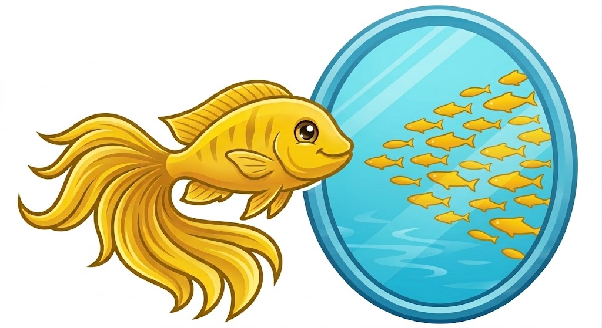

<div align="center">



# LemonFish

**A hardened fork of [MiroFish](https://github.com/666ghj/MiroFish)**

*Multi-agent prediction engine — resilient, multilingual, lightweight*

[](https://github.com/Lvigentini/MiroFish/stargazers)
[](https://github.com/Lvigentini/MiroFish/network)
[](LICENSE)

[Detailed Guide](./docs/DETAILED_GUIDE.md) | [Architecture](./docs/ARCHITECTURE.md) | [Roadmap](./docs/new_features_planning.md)

</div>

---

## Why LemonFish?

LemonFish takes MiroFish and makes it **actually usable** — smaller, more stable, and provider-agnostic.

| | MiroFish | LemonFish |
|---|----------|-----------|
| **Docker image** | 14 GB (CUDA + full Debian) | **~2-3 GB** (CPU-only torch, multi-stage slim build) |
| **LLM failure** | Single call, hard crash | Exponential backoff + automatic fallback model chain |
| **Model choice** | DashScope only | Any OpenAI-compatible API (OpenRouter, Gemini, OpenAI, DeepSeek, Claude, Grok, Qwen, Kimi) |
| **Free-tier support** | None | OpenRouter free models with 4-model fallback out of the box |
| **Setup** | Manual `.env` editing | Interactive wizard — pick provider, paste key, done |
| **Language** | Chinese only | Chinese, English, Spanish (+ easy to add more) |
| **Network** | localhost only | Remote-accessible by default |

---

## Quick Start

```bash
git clone https://github.com/Lvigentini/MiroFish.git lemonfish
cd lemonfish
./setup.sh
```

The wizard walks you through provider selection, API keys, and [Zep Cloud](https://app.getzep.com/) setup (free tier available), then builds and launches a slim Docker container.

Open **http://localhost:3000** when done.

### Local Development (no Docker)

```bash
npm run setup:all   # install frontend (npm) + backend (uv) deps
npm run dev          # runs Flask :5001 + Vite :3000 concurrently
```

---

## What It Does

Upload documents about any topic, describe what you want to predict, and LemonFish builds a simulated social world of AI agents who discuss, argue, and react — then delivers a structured prediction report.

```
Documents  →  Knowledge Graph  →  Agent Personas  →  Social Simulation  →  Prediction Report
(PDF/MD/TXT)   (Zep Cloud)        (LLM-generated)    (Twitter + Reddit)    (with interviews)
```

See the [Detailed Guide](./docs/DETAILED_GUIDE.md) for a full walkthrough of each step.

---

## Slim Docker Image

The single biggest improvement. The original image ships CUDA, triton, and a full Debian install — none of which are needed since all LLM inference happens via remote API.

LemonFish uses a **multi-stage slim build**:
- `python:3.11-slim` base (Debian Bookworm minimal)
- CPU-only PyTorch (~200 MB vs 6.1 GB with CUDA)
- Pre-built frontend static files served by nginx — no Node.js in production
- **Result: ~2-3 GB**, down from 14 GB

```bash
docker-compose -f docker-compose.slim.yml up -d
```

---

## Resilience

Every LLM call is protected by **retry with exponential backoff** (2s → 4s → 8s) and an **automatic fallback model chain**. When the primary model hits rate limits or errors, the next model in the chain takes over seamlessly.

Default OpenRouter fallback chain:
```
gemma-4-31b → llama-3.3-70b → hermes-3-405b → nemotron-120b
```

Graph building is **per-batch**: if batch 47 fails, batches 1-46 are preserved.

All configurable via `.env`:
```env
LLM_FALLBACK_MODELS=model1:free,model2:free,model3:free
LLM_MAX_RETRIES=3
LLM_RETRY_BASE_DELAY=2.0
```

---

## License

AGPL-3.0 — same as the original MiroFish project.

LemonFish is a fork of **[MiroFish](https://github.com/666ghj/MiroFish)** by BaiFu (666ghj). Simulation powered by **[OASIS](https://github.com/camel-ai/oasis)** from CAMEL-AI.
